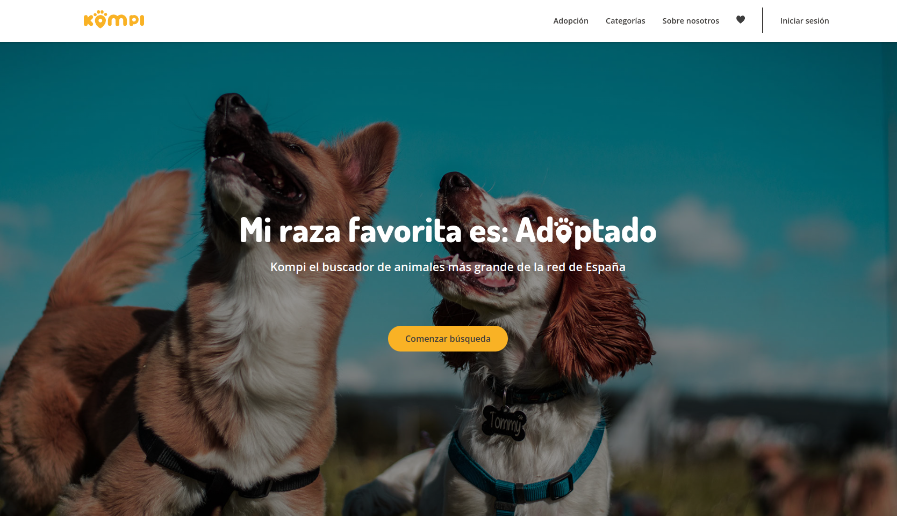

<h1 align="center" style='color:#7434F8'>Hi there, I'm Alexis a Frontend Web Developer  </h1>
 

[][linkedin]
<table align="right">
<tr>
<td>

[][linkedin]
[][twitter]
[][instagram]
[][facebook]

</td>
</tr>
</table>

  
:zap: About me!

### I am currently developing my skills as a programmer by applying them to real-life projects with a scrum methodology. 💻!!
- 👾  Passion for innovation
- 🗒  A believer in learning by doing
- 🤓  Always in search of improving my interpersonal skills.

 

---

<h3 align="center" style='color:#7434F8' > Latest Project</h3>
 

<tr>

<td>

[][kompi]

</td>
<td > <h4 align="left"> <a href="https://adoptaunkompi.com" target="_blank"><code style='color:#F8CF34'>Kompi - Website</code></a> </h4>
  

    
See more...

    A website where you can find your pet for adoption.
    HTML5, CSS3, JS, Vue3.

  
 </td>
</tr>
  
<tr>
<td>

</td>
<td> <h4 align="left"> <a href="https://github.com/alexxispn/pokeapi-card" target="_blank"><code style='color:#F8CF34'>Pokeapi-Card</code></a> </h4>
  

    
See more...

    A card with the stats of all pokemon from kanto.
    HTML5, CSS3, JS.

  
 </td>
</tr>
  
<tr>
<td>

</td>
<td> <h4 align="left"> <a href="https://github.com/alexxispn/music-player" target="_blank"><code style='color:#F8CF34'>Music-Player</code></a> </h4>
  

    
See more...

    A music player.
    HTML5, CSS3, JS.

  
 </td>
</tr>

 
 

---

<h3 align="center" style='color:#7434F8'> Languages and Tools</h3>

    
    
    
    
    
    
    
    
    
    
    
    
    
    

---

<h3 align="left" style='color:#7434F8'> GitHub Stats</h3>

  <a href="https://github.com/alexxispn">
  
  

[twitter]: https://twitter.com/alexxispn
[instagram]: https://www.instagram.com/alexxispn
[facebook]: https://www.facebook.com/alexisplettenern/
[linkedin]: https://www.linkedin.com/in/alexis-plettener-nguyen/
<!-- [youtube]: https://www.youtube.com/c/alexxispn -->
<!-- [reddit]:https://www.reddit.com/user/alexxispn -->

[kompi]: https://adoptaunkompi.com/
